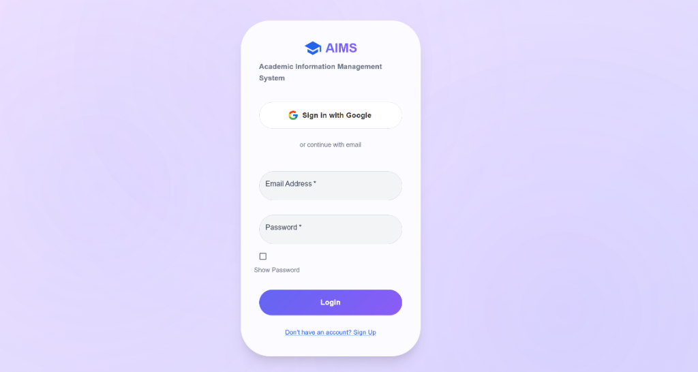
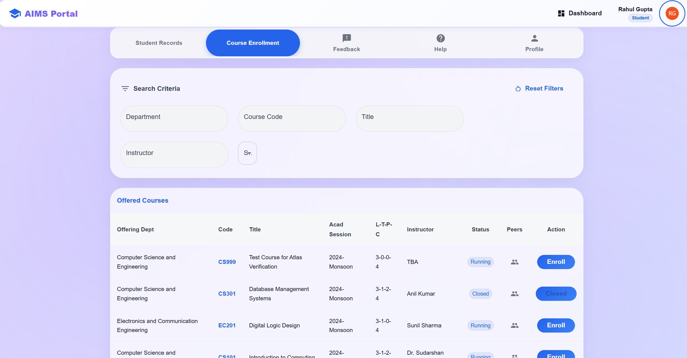
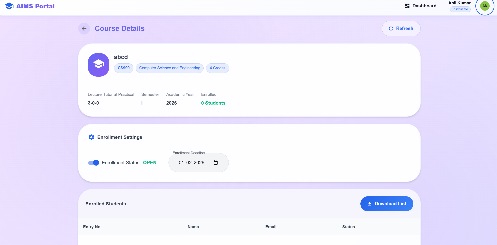
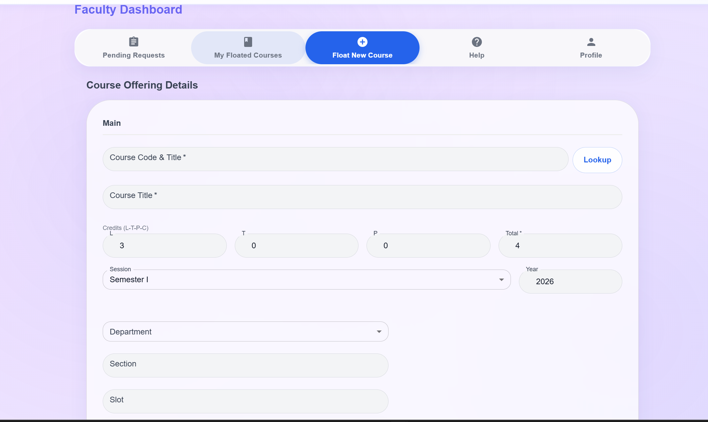
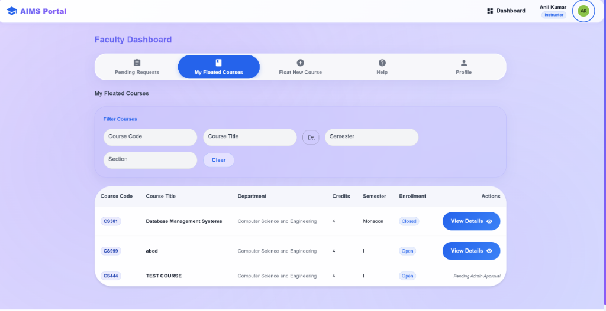
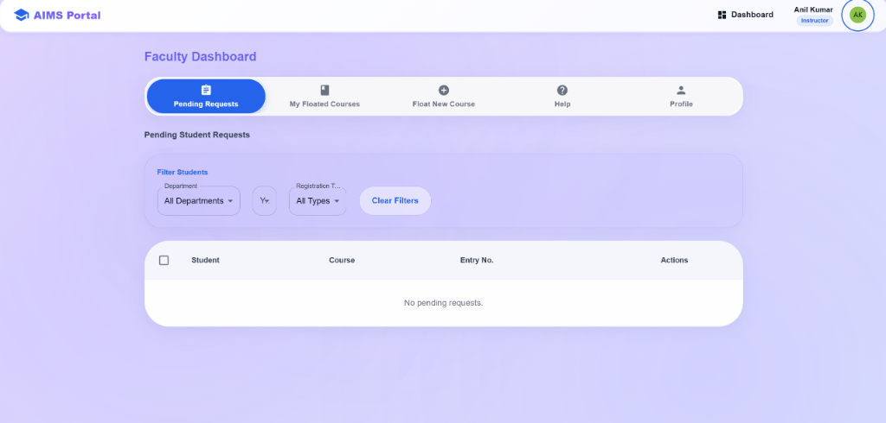
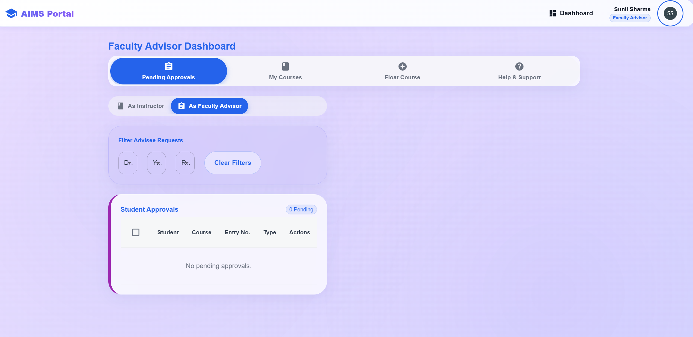
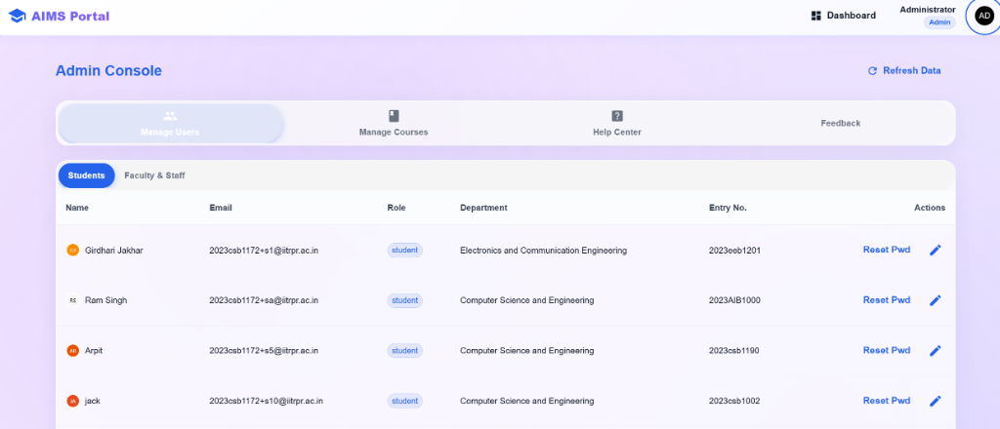
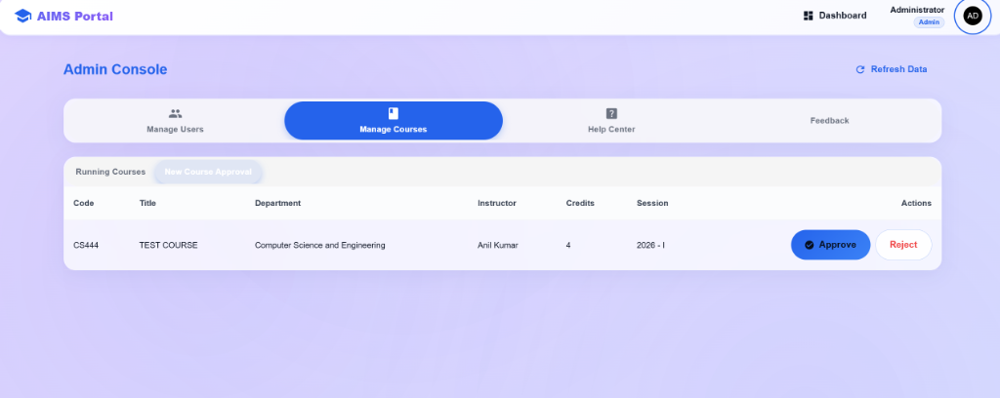

# AIMS - Academic Information Management System

## Project Overview

AIMS (Academic Information Management System) is a comprehensive web-based platform designed to streamline academic course management and enrollment processes. The system provides role-based access for Students, Faculty Advisors, Course Instructors, and Administrators, facilitating efficient course registration, approval workflows, and academic administration.

## Live Demo

The application is deployed and accessible online:

- **Live Application**:https://aims-sepia.vercel.app/login
- **Status**: ✅ Deployed on Vercel



## Key Features

### For Students
- **Course Discovery & Enrollment**: Browse and enroll in available courses
- **Multiple Registration Types**: 
  - Credit courses
  - Minor courses
  - Concentration courses
  - Audit courses
- **Real-time Status Tracking**: Monitor registration status and approvals
- **Student Dashboard**: View enrolled courses, pending registrations, and academic progress
- **Profile Management**: Update personal information and academic details





### For Course Instructors
- **Course Management**: 
  - Float new courses with detailed information
  - Edit course details, prerequisites, and capacity
  - Set enrollment deadlines
  - Toggle enrollment open/close instantly
- **Registration Approval**: Review and approve/reject student enrollment requests
- **Student Management**: View enrolled students and manage course rosters
- **Faculty Dashboard**: Comprehensive view of all managed courses







### For Faculty Advisors
- **Student Oversight**: Monitor advisee course registrations
- **Multi-step Approval Workflow**: 
  - Review registrations after instructor approval
  - Approve or reject with feedback
- **Advisor Dashboard**: Track all advisee activities and pending approvals
- **Department Management**: Oversee students assigned to the advisor



### For Administrators
- **User Management**: 
  - Create and manage user accounts
  - Assign roles (Student, Instructor, Faculty Advisor)
  - Department assignment
- **System Configuration**: Manage faculty advisors and departments
- **Data Oversight**: View system-wide statistics and user activities
- **Feedback Management**: Review and respond to user feedback





### Additional Features
- **Google OAuth Integration**: Secure authentication with Google
- **OTP Verification**: Email-based OTP for account verification
- **Help & Support**: Built-in help request system
- **Feedback System**: Users can submit feedback and suggestions
- **Responsive Design**: Mobile-friendly Material-UI interface
- **Real-time Updates**: Dynamic content updates without page refresh

## Technology Stack

### Frontend
- **Framework**: React 19.2.0
- **Build Tool**: Vite 7.2.4
- **UI Library**: Material-UI (MUI) 7.3.7
- **Routing**: React Router DOM 7.12.0
- **HTTP Client**: Axios 1.13.2
- **Authentication**: Google OAuth (@react-oauth/google)
- **Icons**: MUI Icons, React Icons
- **Styling**: Emotion (CSS-in-JS)

### Backend
- **Runtime**: Node.js
- **Framework**: Express 5.2.1
- **Database**: MongoDB with Mongoose 9.1.4
- **Authentication**: 
  - Passport.js with Google OAuth 2.0
  - JWT (jsonwebtoken)
  - bcryptjs for password hashing
- **Session Management**: express-session
- **Email Service**: Nodemailer 7.0.12
- **Development**: Nodemon 3.1.11
- **Testing**: MongoDB Memory Server (for testing)

### Development Tools
- **Process Management**: Concurrently (run client & server simultaneously)
- **Environment Variables**: dotenv
- **CORS**: cors middleware
- **Code Linting**: ESLint

## Project Structure

```
Aims/
├── client/                      # Frontend React application
│   ├── src/
│   │   ├── components/          # Reusable UI components
│   │   ├── pages/              # Page components
│   │   │   ├── dashboards/     # Role-specific dashboards
│   │   │   │   ├── StudentDashboard.jsx
│   │   │   │   ├── FacultyDashboard.jsx
│   │   │   │   ├── AdvisorDashboard.jsx
│   │   │   │   └── AdminDashboard.jsx
│   │   │   ├── Login.jsx
│   │   │   ├── Register.jsx
│   │   │   ├── Courses.jsx
│   │   │   ├── CourseDetails.jsx
│   │   │   ├── Profile.jsx
│   │   │   └── Feedback.jsx
│   │   ├── context/            # React Context for state management
│   │   ├── utils/              # Utility functions
│   │   ├── theme.js            # MUI theme configuration
│   │   └── App.jsx             # Main application component
│   ├── public/                 # Static assets
│   ├── package.json
│   └── vite.config.js
│
├── server/                     # Backend Express application
│   ├── models/                 # Mongoose models
│   │   ├── User.js
│   │   ├── Course.js
│   │   ├── CourseRegistration.js
│   │   ├── Feedback.js
│   │   └── HelpRequest.js
│   ├── routes/                 # API routes
│   │   ├── auth.js             # Authentication routes
│   │   ├── courses.js          # Course management routes
│   │   ├── api.js              # General API routes
│   │   ├── admin.js            # Admin routes
│   │   └── help.js             # Help & support routes
│   ├── utils/                  # Utility functions
│   ├── passport.js             # Passport configuration
│   ├── index.js                # Server entry point
│   ├── .env                    # Environment variables (not in git)
│   └── package.json
│
├── test_*.js                   # Various test scripts
├── seed_*.js                   # Database seeding scripts
├── package.json                # Root package.json
└── README.md                   # This file
```

## Installation & Setup

### Prerequisites
- **Node.js** (v16 or higher)
- **npm** (v7 or higher)
- **MongoDB** (local installation or MongoDB Atlas account)
- **Google OAuth Credentials** (for authentication)

### Step 1: Clone the Repository
```bash
git clone <repository-url>
```

### Step 2: Install Dependencies
```bash
# Install dependencies for both client and server
npm run install-all

# Or manually:
cd server && npm install
cd ../client && npm install
```

### Step 3: Environment Configuration

#### Server Environment Variables
Create a `.env` file in the `server/` directory:

```env
# MongoDB Connection
MONGO_URI=mongodb://localhost:27017/aims

# JWT Secret (use a strong random string)
JWT_SECRET=your_jwt_secret_key_here

# Server Port
PORT=5000

# Client URL (for CORS)
CLIENT_URL=http://localhost:5173

# Google OAuth Credentials
GOOGLE_CLIENT_ID=your_google_client_id
GOOGLE_CLIENT_SECRET=your_google_client_secret
GOOGLE_CALLBACK_URL=http://localhost:5000/auth/google/callback

# Email Configuration (for OTP)
EMAIL_USER=your_email@gmail.com
EMAIL_PASS=your_app_specific_password

# Session Secret
SESSION_SECRET=your_session_secret_key
```

#### Client Environment Variables (Optional)
Create a `.env` file in the `client/` directory if needed:

```env
VITE_API_URL=http://localhost:5000
VITE_GOOGLE_CLIENT_ID=your_google_client_id
```

### Step 4: MongoDB Setup

**Option 1: Local MongoDB**
- Install MongoDB locally
- Start MongoDB service
- The application will connect to `mongodb://localhost:27017/aims`

**Option 2: MongoDB Atlas**
- Create a free MongoDB Atlas account
- Create a cluster and get the connection string
- Update `MONGO_URI` in your `.env` file

**Option 3: In-Memory Database**
- The application automatically falls back to MongoDB Memory Server if local connection fails
- ⚠️ **Warning**: Data will be lost when the server restarts

## Running the Application

### Development Mode

#### Option 1: Run Both Client and Server (Recommended)
```bash
npm start
```
This will start:
- Backend server on `http://localhost:5000`
- Frontend development server on `http://localhost:5173`

#### Option 2: Run Separately

**Start Server Only:**
```bash
npm run server
# or with nodemon for auto-restart:
npm run server:dev
```

**Start Client Only:**
```bash
npm run client
```

### Production Build

```bash
# Build the client
cd client
npm run build

# The build output will be in client/dist/
```

## Accessing the Application

### Live Deployment
- **Production URL**: https://aims-sepia.vercel.app/login
- **Platform**: Vercel
- **Status**: Live ✅

### Local Development
Once running locally, access the application at:
- **Frontend**: http://localhost:5173
- **Backend API**: http://localhost:5000

### Default User Roles
After setting up, you can create users with different roles:
- **Students**: Use email pattern like `student@iitrpr.ac.in`
- **Instructors**: Accounts with instructor role assigned by admin
- **Faculty Advisors**: Accounts with faculty advisor role assigned by admin
- **Admins**: First user or users with admin role

## Deployment

### Deployed on Vercel

This application is deployed on Vercel with the following configuration:

#### Frontend Deployment (Vercel)
The React frontend is deployed on Vercel with automatic deployments from the main branch.

**Vercel Configuration** (`client/vercel.json`):
```json
{
  "rewrites": [
    {
      "source": "/(.*)",
      "destination": "/index.html"
    }
  ]
}
```

This configuration ensures proper routing for the React SPA (Single Page Application).

#### Backend Deployment
The backend can be deployed on:
- **Vercel** (Serverless functions)
- **Render** (Recommended for Express apps)
- **Railway**
- **Heroku**
- Any Node.js hosting platform

#### Deployment Steps (Vercel)

**Frontend:**
1. Push your code to GitHub/GitLab
2. Connect repository to Vercel
3. Set build configuration:
   - **Framework Preset**: Vite
   - **Root Directory**: `client`
   - **Build Command**: `npm run build`
   - **Output Directory**: `dist`
4. Add environment variables:
   - `VITE_API_URL` - Your backend API URL
   - `VITE_GOOGLE_CLIENT_ID` - Google OAuth Client ID
5. Deploy!

**Backend (if using Vercel):**
1. Create a new Vercel project for the backend
2. Set **Root Directory**: `server`
3. Add environment variables (all variables from `.env`)
4. Deploy

**Environment Variables for Production:**
Ensure these are set in your Vercel dashboard:
- `MONGO_URI` - MongoDB connection string (use MongoDB Atlas)
- `JWT_SECRET` - Strong secret key
- `GOOGLE_CLIENT_ID` - Google OAuth credentials
- `GOOGLE_CLIENT_SECRET` - Google OAuth secret
- `CLIENT_URL` - Frontend URL (Vercel URL)
- `EMAIL_USER` - Email for OTP service
- `EMAIL_PASS` - App-specific password

#### Post-Deployment Checklist
- ✅ Update Google OAuth authorized redirect URIs
- ✅ Configure CORS to allow your frontend domain
- ✅ Set up MongoDB Atlas for production database
- ✅ Test all authentication flows
- ✅ Verify email OTP functionality
- ✅ Test course registration workflow

## Database Seeding

Seed the database with sample data:

```bash
# Seed sample users
node seed_user.js

# Seed faculty members
node seed_faculty.js

# Seed courses
node server/seed_courses.js

# Create faculty advisors
node server/create_faculty_advisors.js
```

## Testing

The project includes various test scripts:

```bash
# Test authentication flow
node test_auth.js

# Test course flow
node test_course_flow.js

# Test user roles
node test_roles.js

# Test data persistence
node test_persistence.js

# Test enrollment logic
node server/test_enrollment_logic.js
```

## API Endpoints

### Authentication
- `POST /auth/register` - Register new user
- `POST /auth/login` - User login
- `POST /auth/verify-otp` - Verify OTP
- `POST /auth/logout` - User logout
- `GET /auth/google` - Google OAuth login
- `GET /auth/google/callback` - Google OAuth callback

### Courses
- `GET /api/courses` - Get all available courses
- `GET /api/courses/:id` - Get course details
- `POST /api/courses` - Create new course (Instructor)
- `PUT /api/courses/:id` - Update course (Instructor)
- `DELETE /api/courses/:id` - Delete course (Instructor)
- `POST /api/courses/:id/register` - Register for course (Student)
- `GET /api/courses/:id/registrations` - Get course registrations (Instructor)
- `PUT /api/courses/:id/registrations/:regId` - Approve/Reject registration

### User & Profile
- `GET /api/profile` - Get user profile
- `PUT /api/profile` - Update user profile
- `GET /api/user/registrations` - Get user's course registrations

### Admin
- `GET /api/admin/users` - Get all users
- `POST /api/admin/users` - Create new user
- `PUT /api/admin/users/:id` - Update user role/details
- `DELETE /api/admin/users/:id` - Delete user

### Help & Feedback
- `POST /api/help/request` - Submit help request
- `GET /api/help/requests` - Get help requests
- `POST /api/feedback` - Submit feedback
- `GET /api/feedback` - Get all feedback

## Security Features

- **JWT Authentication**: Secure token-based authentication
- **Password Hashing**: bcryptjs for secure password storage
- **Google OAuth**: Secure third-party authentication
- **OTP Verification**: Email-based verification for account security
- **Session Management**: Secure session handling with express-session
- **CORS Protection**: Configured CORS for allowed origins
- **Environment Variables**: Sensitive data stored securely in .env files

## Design Features

- **Material Design**: Modern UI with Material-UI components
- **Responsive Layout**: Mobile-first responsive design
- **Theme Customization**: Custom theme with brand colors
- **Dark Mode Support**: (if implemented)
- **Smooth Animations**: Enhanced user experience with transitions
- **Intuitive Navigation**: Clear navigation structure

## User Workflows

### Student Journey
1. Register/Login → Verify Email (OTP)
2. Complete Profile → Dashboard
3. Browse Courses → View Course Details
4. Register for Course → Wait for Instructor Approval
5. After Instructor Approval → Wait for Advisor Approval
6. Enrollment Confirmed → Access Course Materials

### Instructor Journey
1. Login → Faculty Dashboard
2. Float New Course → Set Details & Deadlines
3. Manage Enrollments → Review Student Requests
4. Approve/Reject → Student notified
5. Monitor Course → Update Details as needed

### Faculty Advisor Journey
1. Login → Advisor Dashboard
2. View Advisee Registrations
3. Review Instructor-Approved Registrations
4. Approve/Reject with Feedback
5. Monitor Student Progress

## Troubleshooting

### MongoDB Connection Issues
- Ensure MongoDB is running: `mongod` or check Atlas connection
- Verify `MONGO_URI` in `.env` file
- Check firewall settings for port 27017

### Port Already in Use
```bash
# Kill process on port 5000 (server)
npx kill-port 5000

# Kill process on port 5173 (client)
npx kill-port 5173
```

### Google OAuth Not Working
- Verify Google Client ID and Secret in `.env`
- Check authorized redirect URIs in Google Console
- Ensure callback URL matches configuration

### Email OTP Not Sending
- Verify email credentials in `.env`
- Use App-Specific Password for Gmail
- Check email service firewall/security settings

## Scripts Reference

### Root Level
- `npm start` - Run both client and server
- `npm run dev` - Run in development mode with hot reload
- `npm run server` - Run server only
- `npm run server:dev` - Run server with nodemon
- `npm run client` - Run client only
- `npm run install-all` - Install all dependencies

### Client
- `npm run dev` - Start Vite dev server
- `npm run build` - Build for production
- `npm run preview` - Preview production build
- `npm run lint` - Run ESLint

### Server
- `npm start` - Start server
- `npm run dev` - Start with nodemon

## User Roles & Permissions

| Feature | Student | Instructor | Faculty Advisor | Admin |
|---------|---------|------------|-----------------|-------|
| View Courses | ✅ | ✅ | ✅ | ✅ |
| Register for Courses | ✅ | ❌ | ❌ | ❌ |
| Float Courses | ❌ | ✅ | ❌ | ✅ |
| Approve Registrations (Instructor) | ❌ | ✅ | ❌ | ✅ |
| Approve Registrations (Advisor) | ❌ | ❌ | ✅ | ✅ |
| Manage Users | ❌ | ❌ | ❌ | ✅ |
| View All Data | ❌ | Courses Only | Advisees Only | ✅ |

## Contributing

This is an academic project. For any improvements or bug fixes:
1. Document the issue
2. Propose solution
3. Test thoroughly
4. Update documentation

## License

This project is created for academic purposes as part of a course assignment.

## Author

- **Name**: Aditya Gupta
- **Institution**: IIT Ropar
- **Course**: Academic Information Management System

## Support

For any questions or issues:
- Use the in-app Help & Support feature
- Submit feedback through the Feedback system
- Check the test scripts for examples

## Assignment Submission Notes

### Project Highlights
- ✅ Full-stack MERN application
- ✅ Role-based access control (4 roles)
- ✅ Multi-step approval workflow
- ✅ Google OAuth integration
- ✅ Email OTP verification
- ✅ Responsive Material-UI design
- ✅ RESTful API architecture
- ✅ MongoDB data persistence
- ✅ Comprehensive error handling
- ✅ Security best practices
- ✅ **Deployed on Vercel** (Production-ready)

### Key Achievements
1. Successfully implemented complex multi-role system
2. Created seamless course registration workflow
3. Integrated multiple authentication methods
4. Built responsive, user-friendly interface
5. Established scalable backend architecture
6. **Deployed application to production on Vercel**

---

**Last Updated**: January 2026  
**Version**: 1.0.0  
**Status**: Active Development
